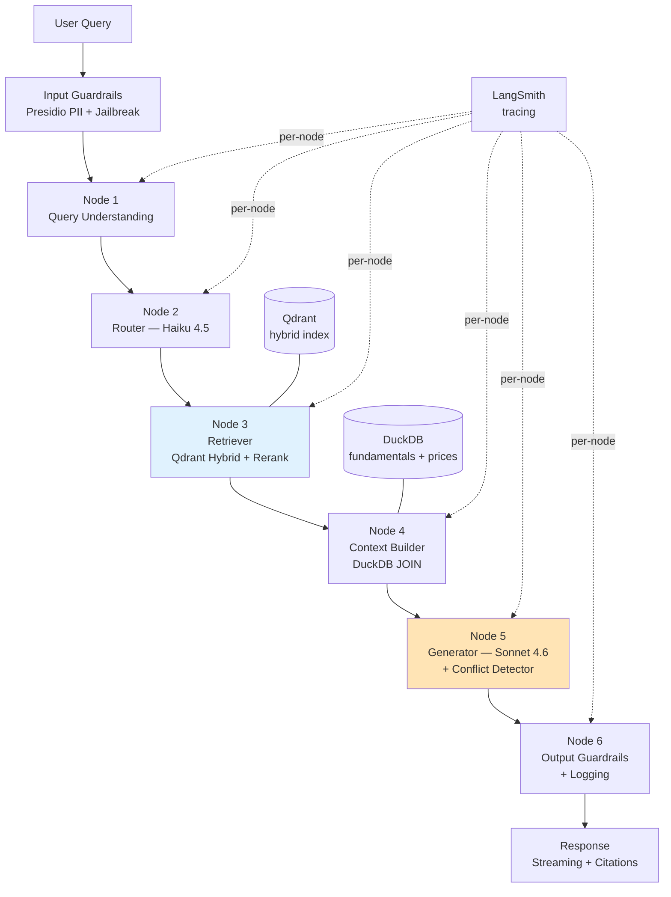

# FinSight — Architecture

**Canonical spec:** `docs/finsight_spec_v2.3.md`
**Last updated:** 2026-04-29 (Week 1 Day 1 — scaffolding)

---

## High-level diagram



Node 5 highlighted — contains the Evidence Conflict Detector (differentiator). Node 3 highlighted — hybrid retrieval + recency boost + Cohere rerank.

---

## Data flow

### Ingestion pipeline (offline, run once per data refresh)

```
Raw sources                 Processed                Indexed
-----------                 ---------                -------
Motley Fool .json    -->    chunks.parquet     -->   Qdrant (text + dense + sparse)
SEC XBRL zip         -->    fundamentals.ddb   -->   DuckDB (ticker + period)
OHLCV .csv           -->    prices.ddb         -->   DuckDB (ticker + date)
News .csv            -->    news_chunks.parq   -->   Qdrant (text + dense + sparse)
```

All raw data versioned with DVC. Processing scripts live in `src/ingestion/`.

### Query pipeline (online, per user request)

```
raw query
  └─> input guardrails: PII scan, jailbreak check
       └─> LangGraph StateGraph invocation
            │
            ▸ Node 1: Query Understanding (Sonnet, prompt-cached)
            │   - Rewriter: "AAPL Q3" → "Apple Q3 2024 earnings revenue guidance"
            │   - Expander: synonym augmentation for finance terms
            │   - Multi-hop decomposer: compound queries → sub-queries
            │   - Temporal reference extraction
            │
            ▸ Node 2: Router (Haiku, prompt-cached)
            │   - Classify into {earnings_analysis, financial_metrics, price_action, news_sentiment}
            │   - Set routing_path in state
            │
            ▸ Node 3: Retriever
            │   - Qdrant hybrid BM25 + dense (voyage-finance-2)
            │   - Temporal metadata filter + recency boost (+0.15 for last 2Q)
            │   - Cohere Rerank 3.5 on top-20 → top-5
            │   - Degraded mode: bge-m3 + MiniLM cross-encoder if primary APIs fail
            │
            ▸ Node 4: Context Builder
            │   - DuckDB JOIN on (ticker, period) appends fundamentals
            │   - Event-window OHLCV chart (if routing_path == price_action)
            │   - Staleness check: flag if best chunk > 2Q old
            │
            ▸ Node 5: Generator + Conflict Detector
            │   - Sonnet 4.6 streaming with cached system prompt + tool defs
            │   - Structured tool use: emit_answer(answer, citations: list[Citation])
            │   - Conflict detector (parallel): scan chunks for contradictory numeric claims
            │   - Calibrated thresholds per metric type (revenue ±$500M, EPS ±$0.05, guidance ±1pp)
            │
            ▸ Node 6: Output Guardrails + Logging
                - Faithfulness scoring (RAGAS) on response
                - Scope checker (out-of-domain flag)
                - Failure mode classifier (5 categories)
                - LangSmith trace + cost log

streaming response to client (FastAPI → Streamlit)
```

---

## State schema (LangGraph)

```python
class FinSightState(TypedDict):
    # Input
    raw_query: str
    conversation_history: list[Message]  # last 3 turns

    # Node 1 outputs
    rewritten_query: str
    sub_queries: list[str]
    temporal_reference: Optional[TemporalRef]

    # Node 2 outputs
    routing_path: Literal["earnings_analysis", "financial_metrics", "price_action", "news_sentiment"]

    # Node 3 outputs
    retrieved_chunks: list[Chunk]
    retrieval_metadata: RetrievalMeta  # scores, latency, degraded_mode flag

    # Node 4 outputs
    fundamentals_row: Optional[FundamentalsRow]
    price_window: Optional[PriceWindow]
    staleness_flag: bool

    # Node 5 outputs
    answer: str
    citations: list[Citation]
    conflicts: list[Conflict]

    # Node 6 outputs
    faithfulness_score: float
    guardrail_flags: GuardrailFlags
    failure_mode: Optional[FailureMode]
    cost_usd: float
    latency_per_node_ms: dict[str, int]
```

---

## Module boundaries

| Module | Responsibility | Key files |
|---|---|---|
| `src/ingestion/` | Load raw → parquet/duckdb; temporal tagging | `loader.py`, `schema.py`, `temporal_tagger.py` |
| `src/indexing/` | Chunking strategies; Qdrant upsert | `chunker.py`, `qdrant_client.py`, `ingest_vectors.py` |
| `src/retrieval/` | LangGraph nodes 1-4 | `graph.py`, `query_understanding.py`, `router.py`, `retriever.py`, `context_builder.py`, `degradation.py` |
| `src/generation/` | Node 5 | `generator.py`, `citation_parser.py`, `tool_schemas.py` |
| `src/insight/` | Differentiator | `conflict_detector.py` |
| `src/guardrails/` | Input + output safety | `input_guard.py`, `output_guard.py` |
| `src/recommendations/` | Shared-embedding recs | `related_tickers.py` |
| `src/evaluation/` | Evals + ablations | `ragas_runner.py`, `ablation.py`, `llm_compare.py`, `golden_set.py` |
| `api/` | FastAPI async serving | `main.py` |
| `ui/` | Streamlit 5-tab demo | `streamlit_app.py` |

---

## Interface contracts (Pydantic schemas — Week 2)

To be written in `src/generation/tool_schemas.py`. Summary:

```python
class Citation(BaseModel):
    source_type: Literal["transcript", "sec_filing", "news", "fundamentals", "ohlcv"]
    source_id: str         # e.g. "AAPL-2024-Q3-earnings-call"
    date: date
    ticker: Optional[str]
    quote: str             # extracted text
    confidence: float

class Conflict(BaseModel):
    metric: Literal["revenue", "eps", "guidance_pct", "margin", "other"]
    source_a: Citation
    value_a: float
    source_b: Citation
    value_b: float
    delta: float
    threshold: float
    authority_winner: Optional[str]  # e.g. "sec_filing > transcript"

class FailureMode(str, Enum):
    RETRIEVAL_MISS = "retrieval_miss"
    BAD_RANKING = "bad_ranking"
    HALLUCINATION = "hallucination"
    AMBIGUOUS_QUERY = "ambiguous_query"
    STALE_DATA = "stale_data"
    NONE = "none"
```

---

## Observability

- **LangSmith** traces every node + LLM call + tool invocation. Project: `finsight-dev` (dev) / `finsight-prod` (Render).
- **MLflow** tracks ablation runs, chunking experiments, faithfulness eval scores. Local for dev; skip Render for v2.3.
- **Cost tracker** (`src/utils/cost_tracker.py`) logs per-query token + API costs to `logs/cost_log.jsonl`.
- **Failure tracker** (`src/utils/failure_tracker.py`) writes every query with classification to `logs/query_log.jsonl`.

---

## Deployment topology

### Dev (Docker Compose)

```
┌─────────────────────────────────────────────────────┐
│ localhost                                           │
│                                                     │
│  finsight-ui (Streamlit) :8501                      │
│         │                                           │
│         ▼                                           │
│  finsight-api (FastAPI) :8000                       │
│         │                                           │
│         ├──> finsight-qdrant :6333                  │
│         ├──> finsight-mlflow :5000                  │
│         └──> External APIs:                         │
│              Anthropic / Voyage / Cohere /          │
│              LangSmith                              │
└─────────────────────────────────────────────────────┘
```

### Prod (Render + Qdrant Cloud)

```
┌─────────────────────────────┐
│ Render (always-on $7/mo)    │
│                             │
│  finsight-api + ui combined │─────┐
│                             │     │
└──────────────┬──────────────┘     │
               │                    │
               ▼                    ▼
        Qdrant Cloud          External APIs
        (free 1GB)            Anthropic / Voyage /
                              Cohere / LangSmith
```

DuckDB file shipped in container (small — fundamentals + prices for 100 tickers × 2 years ≈ 50MB).

---

## Scaling path (interview answer, not v2.3 work)

- **100K queries/day:** Qdrant Cloud horizontal scaling (paid tier); LLM cost stays bounded via prompt caching 80%+ hit rate
- **1M queries/day:** Move Cohere Rerank local to avoid API ceiling; batch queries to Anthropic Messages Batches API for 50% cost reduction
- **Multi-tenant:** Qdrant collection-per-tenant; per-tenant embedding isolation; SSO via OIDC (future)
- **Real-time ingestion:** Scheduled DVC pipeline + incremental Qdrant upsert; EDGAR RSS feed for new filings

---

## Versioning

- Code: semver via git tags
- Models: pinned in `.env` (ANTHROPIC_PRIMARY_MODEL, VOYAGE_MODEL, COHERE_RERANK_MODEL)
- Data: DVC
- Experiments: MLflow run IDs
