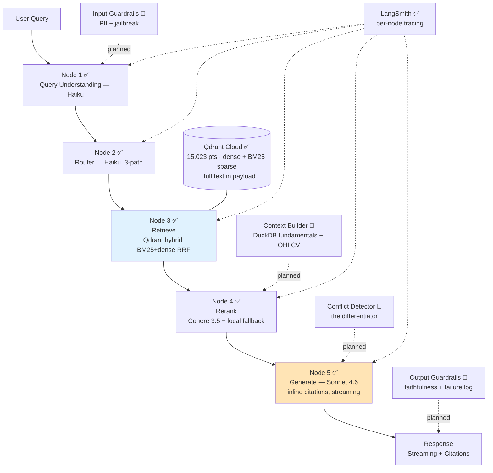

# FinSight — Architecture

**Canonical spec:** `docs/finsight_spec_v2.3.md`
**Last updated:** 2026-07-12 (Week 2 — retrieval pipeline live on Render)

**Legend:** ✅ implemented & live · 🔶 partial · 🔷 planned (Week 3–4). This doc
describes what's actually built; planned nodes are marked so it stays honest to
a reviewer.

---

## High-level diagram



The current live pipeline is the 5-node chain N1→N5. The Context Builder,
Conflict Detector (the differentiator), and guardrail nodes are Week 3–4 and
slot into the same `StateGraph` as additional nodes.

---

## Data flow

### Ingestion pipeline (offline, run once per data refresh)

```
Raw sources                Processed                 Indexed
-----------                ---------                 -------
Motley Fool .pkl    -->    documents (DuckDB)  -->   chunks (DuckDB)  -->  Qdrant
                                                     + voyage-finance-2 dense vec
                                                     + BM25 sparse vec
                                                     + full text in payload
OHLCV .csv          -->    prices (DuckDB)     -->   (Node-4 context, planned)
SEC EDGAR .htm      -->    documents (DuckDB)  -->   (financial_metrics /
                                                      risk_and_events, planned)
```

Loaders (`src/ingestion/`) populate DuckDB `documents`/`prices`. The indexing
pipeline (`src/indexing/`) chunks + embeds → DuckDB `chunks` + Qdrant. Utility
and deployment scripts live in `scripts/` (see README "Reproducing the data").

**Current corpus:** earnings-call transcripts only — 15,023 chunks across 76
tickers (2019–2023). SEC fundamentals + 10-K risk factors are fetched but not
yet chunked/indexed, so the `financial_metrics` / `risk_and_events` paths route
correctly but abstain until that corpus lands.

### Query pipeline (online, per user request) — CURRENT

```
raw query
  └─> LangGraph StateGraph.invoke()   (src/retrieval/graph.py)
       │
       ▸ Node 1 ✅ Query Understanding (Haiku)
       │   - Rewrite to a self-contained, retrieval-friendly query
       │   - Extract ticker hint (e.g. "AAPL")
       │
       ▸ Node 2 ✅ Router (Haiku, 3-path)
       │   - Classify into {earnings_analysis, financial_metrics, risk_and_events}
       │   - Cheap Haiku classification (the cost-routing story)
       │
       ▸ Node 3 ✅ Retrieve (hybrid)
       │   - Qdrant native RRF fusion: dense (voyage-finance-2) + BM25 sparse
       │   - One server-side query; prefetch ~20 candidates
       │
       ▸ Node 4 ✅ Rerank
       │   - Cohere rerank-v3.5 (primary) → top-k
       │   - Falls back to local ms-marco cross-encoder on any Cohere error
       │
       ▸ Node 5 ✅ Generate (Sonnet 4.6)
       │   - Streaming; inline [N] citations parsed to structured Citations
       │   - Abstains ("INSUFFICIENT EVIDENCE") when chunks don't support an answer

streaming response to client (FastAPI /query, /query/stream → Streamlit)
```

### Planned nodes (Week 3–4) — slot into the same graph

- 🔷 **Input guardrails** (before Node 1): Presidio PII scan + jailbreak check
- 🔷 **Context Builder** (after Node 4): DuckDB JOIN for fundamentals; OHLCV
  event-window enrichment (universal context, per DEC-004 — not a router path);
  staleness flag
- 🔷 **Conflict Detector** (in/after Node 5): scan evidence for contradictory
  numeric claims (revenue / EPS / guidance) with calibrated per-metric thresholds
  — THE differentiator
- 🔷 **Output guardrails** (after Node 5): faithfulness scoring, scope check,
  5-category failure-mode logging, cost log

---

## State schema (LangGraph) — CURRENT

Actual schema in `src/retrieval/graph_state.py` (Week-2 MVP; fields grow as
nodes are added):

```python
RoutingPath = Literal["earnings_analysis", "financial_metrics", "risk_and_events"]

class FinSightState(TypedDict, total=False):
    # Input
    raw_query: str
    top_k: int
    # Node 1 — Query Understanding
    rewritten_query: str
    ticker_hint: Optional[str]
    # Node 2 — Router
    routing_path: RoutingPath
    # Node 3 — Retrieve (hybrid)
    candidates: list[RetrievedChunk]
    # Node 4 — Rerank
    reranked: list[RetrievedChunk]
    # Node 5 — Generate
    answer: str
    citations: list[Citation]
    grounded: bool
    # Observability
    latency_ms: dict[str, int]     # per-node
    tokens: dict[str, int]
```

**Planned additions (Week 3–4):** `sub_queries`, `temporal_reference`,
`fundamentals_row`, `price_window`, `staleness_flag`, `conflicts`,
`faithfulness_score`, `guardrail_flags`, `failure_mode`, `cost_usd`.

---

## Module boundaries

| Module | Responsibility | Key files | Status |
|---|---|---|---|
| `src/ingestion/` | Load raw → DuckDB `documents`/`prices` | `motley_fool_loader.py`, `ohlcv_loader.py`, `sec_filing_parser.py`, `schema.py` | ✅ |
| `src/indexing/` | Chunk, embed (voyage/bge-m3), sparse BM25, Qdrant upsert | `chunker.py`, `embedder.py`, `ingest_vectors.py`, `qdrant_client.py` | ✅ |
| `src/retrieval/` | Hybrid retrieval, rerank, LangGraph pipeline | `retriever.py`, `reranker.py`, `graph.py`, `graph_state.py`, `nodes.py` | ✅ |
| `src/generation/` | Sonnet generation + inline citation parsing | `generator.py` | ✅ |
| `src/insight/` | Evidence Conflict Detector (differentiator) | `conflict_detector.py` | 🔷 Week 3 |
| `src/guardrails/` | Input + output safety | `input_guard.py`, `output_guard.py` | 🔷 Week 4 |
| `src/recommendations/` | Shared-embedding related tickers | `related_tickers.py` | 🔷 Week 4 |
| `src/evaluation/` | RAGAS + ablations + LLM compare | `ragas_runner.py`, `ablation.py`, `golden_set.py` | 🔷 Week 3 |
| `src/utils/` | Config, logging (cost/failure trackers planned) | `config.py`, `logging.py` | ✅ |
| `api/` | FastAPI async serving | `main.py` (`/health`, `/query`, `/query/stream`) | ✅ |
| `ui/` | Streamlit demo (5-tab in Week 4) | `streamlit_app.py` | 🔶 single-query now |

Node functions (`query_understanding`, `router`, `retrieve`, `rerank`,
`generate`) all live in `src/retrieval/nodes.py` — not separate files.

---

## Observability

- **LangSmith** ✅ traces every node when `LANGSMITH_TRACING=true` +
  `LANGSMITH_API_KEY` set. Project: `finsight-dev`.
- **Per-node latency** ✅ captured in `FinSightState.latency_ms` and returned in
  the `/query` response (`latency_per_node_ms`).
- **MLflow** 🔷 ablation-run tracking — Week 3.
- **Cost / failure trackers** 🔷 `src/utils/` — Week 4.

---

## Deployment topology

### Dev (local)

```
localhost
  finsight-ui (Streamlit) :8501  ──>  finsight-api (FastAPI) :8000
                                          ├──> Qdrant (Colima/Docker :6333, or Cloud)
                                          └──> External APIs: Anthropic / Voyage / Cohere / LangSmith
```

Qdrant runs via Colima or Docker Compose locally (DEC: Colima chosen — no Docker
Desktop account needed). bge-m3 embeddings available locally as the Voyage fallback.

### Prod (Render + Qdrant Cloud) — LIVE

```
Render (free tier)                         Qdrant Cloud (free 1GB, finsight-prod)
  finsight-api  (FastAPI)  ──────────────>  15,023 pts · dense + BM25 sparse
  finsight-ui   (Streamlit) ──> API              + full chunk text in payload
        │
        └──> External APIs: Anthropic (Sonnet+Haiku) / Voyage / Cohere / LangSmith
```

**Self-contained serve (no local model, no DuckDB):** deploy uses the Voyage API
for embeddings (no bge-m3 model in the 512MB dyno) and reads full chunk text from
the Qdrant payload (no 664MB DuckDB shipped). `USE_DUCKDB_HYDRATION=false`,
`EMBEDDING_BACKEND=voyage`. Cold-start (~50s after 15-min idle) mitigated by an
external cron pinging `/health`.

---

## Scaling path (interview answer, not v2.3 work)

- **100K queries/day:** Qdrant Cloud paid tier (horizontal); LLM cost bounded by
  prompt caching once the pipeline prompt clears the cache-min threshold.
- **1M queries/day:** move Cohere Rerank local to avoid API ceiling; batch to
  Anthropic Messages Batches API for 50% cost reduction.
- **Multi-tenant:** Qdrant collection-per-tenant; SSO via OIDC.
- **Real-time ingestion:** EDGAR RSS + incremental Qdrant upsert.

---

## Versioning

- Code: git tags (semver)
- Models: pinned in `.env` (`ANTHROPIC_PRIMARY_MODEL`, `ANTHROPIC_ROUTER_MODEL`,
  `VOYAGE_MODEL`, `COHERE_RERANK_MODEL`)
- Data: gitignored; regenerable via the README reproduction runbook
